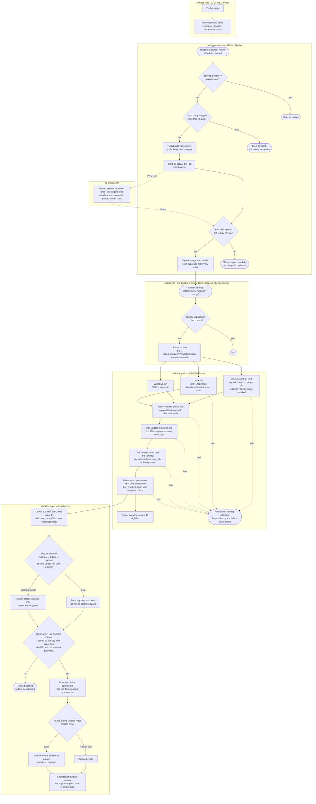

# Update plan: private changes reach users as nightly app builds

Status: in progress on `workflow/update` · 2026-10-06

## Decision

Ship everything, including the closed-source `private/` code, as normal app builds, and make those builds automatic:

```
push to private main
  └─► private-pointer.yml   (bot PR on develop moving the private/ pointer,
        │                    merged by the bot once "PR checks" pass; throttled)
        ▼
push to develop
  └─► nightly.yml           (version 3.0.1-beta.9.nightly.<stamp>, never committed)
        └─► release.yml     (build all platforms, check the assets, publish a GitHub pre-release)
              ▼
beta installs: electron-updater finds it, downloads it in the background, installs on restart
stable installs: unaffected, they only take stable releases
```

This replaces the live engine as the way private changes reach users. The live-engine workflow stays as a manual emergency hotfix path.

## How it works



## How a broken build is caught

Each stage stops everything after it, so a failure anywhere means nothing is published.

| # | Stage | Catches | On failure |
|---|---|---|---|
| 1 | **PR checks** (every PR, including the bot's) | Failing runtime and compiler tests; a private change that breaks the viewer bundle | PR can't merge; the bot leaves it open; Teams alert |
| 2 | **Platform builds** | Any error while building or packing; an empty pack (`build-pack.ts` exits with an error, uploads use `if-no-files-found: error`) | No release |
| 3 | **macOS check**: `codesign --verify --deep --strict`, `spctl --assess`, `stapler validate` | A build electron-builder left unsigned, or one notarization quietly skipped. Either would refuse to install as an update. | No release |
| 4 | **Linux launch smoke test**: the packaged app starts under xvfb with `XGENIA_SMOKE_TEST=1` (`src/main/src/smoke-test.js`) | A build that compiles but crashes, shows a blank window, or hangs on start | No release |
| 5 | **Collecting assets** | A missing platform or chip build, mismatched versions, a manifest listing a file that wasn't built | No release |
| 6 | **Signing** | Missing key, or a key the app doesn't trust | No release |
| 7 | **Verify the draft**: the release is read back from GitHub (`verify-release.mjs --draft`) | A failed or partial upload, a missing manifest or `.sig`, a file of the wrong size | Stays a draft; no install sees it |
| 8 | **Public check** after publishing (`--public`, with retries) | Anything wrong with what installs actually download | Turned back into a draft automatically |
| 9 | **In the app** | A manifest or file that doesn't match what CI signed | Not downloaded |
| — | **Alerts**: `nightly.yml` and `private-pointer.yml` notify Teams on any failure, alongside the existing per-platform build card | — | — |
| — | **Who's affected if something still slips through** | Nightlies only reach users who opted into Beta; Stable releases stay drafts until a person publishes them | — |

The smoke test runs on Linux only: it's the cheapest runner with a virtual display. Windows and macOS share the same app code, so a crash at startup shows up there too. A Windows smoke run (no xvfb needed) is easy to add later if platform-specific crashes appear.

## When a bad build gets out anyway

1. **Stop it spreading:** Actions → **Pull a release** → the tag and a reason. It becomes a draft again, so no install sees it. The equivalent command is `gh release edit <tag> --draft=true`.
2. **Fix the installs that already took it:** revert the change on `develop`, or let the bot bring in the private fix. The next nightly has a later timestamp, so it's a higher version, and Beta installs update to it within 4 hours, or straight away with Settings → Updates → Check for updates.
3. **A bad Stable release:** pull it the same way, then publish a higher patch version (for example `3.1.1` after `3.1.0`). Never re-use a version number: installs that already have it would never update.

The manual paths still exist alongside it:
- **Stable releases:** run `release.yml` on `main` after `develop` is squash-merged there. It creates a draft, someone checks it and presses Publish, and every install (stable and beta) updates.
- **Emergency engine hotfix:** the `Live Engine` workflow, run by hand. A later app update replaces whatever it shipped.

Why not keep the live engine, or build a separate pro-node pack? Both add code-loading machinery to the app: about 2,600 lines today for the live engine. They exist only because app releases were rare. Fixing the release pipeline fixes the actual problem with tools the app already has.

---

## Why the auto-updater never worked

| # | Problem | Evidence | Fix |
|---|---|---|---|
| 1 | Almost nothing to update to | Only 2 releases ever, `V2.0.0` and `V2.1.0` (last on 2026-06-15). Beta builds were never published. | `nightly.yml` publishes every change to `develop` as a pre-release |
| 2 | Uppercase tags | `V2.1.0` is not valid semver, so electron-updater can't read a channel from it. Beta installs (`3.0.1-beta.9`) saw "2.1.0" as the newest. | `release.yml` already uses lowercase `v` |
| 3 | No macOS update payload | The releases have a `.dmg` but no `-mac-*.zip`. Squirrel.Mac can only install from the zip. | `release.yml` packs the zip (`XGENIA_RELEASE=1`) and merges the per-arch manifests |
| 4 | Releases stopped at a draft | Someone had to press Publish, so builds piled up unpublished. | Nightlies go out published, as pre-releases. Stable releases stay drafts for review. |
| 5 | The update flow itself | It asked before downloading, never asked again after "No", stopped checking once an update was found, and showed error boxes for background failures. | `autoupdater.js` rewritten (below) |
| 6 | Builds ignored the private pointer | `git submodule update --remote` built whatever private `main` was, so a build couldn't be traced to a private commit. | Builds use the pinned pointer, which the bot keeps current |

### The updater flow now (`packages/xgenia-editor/src/main/src/autoupdater.js`)

The same flow VS Code, Slack and Discord use, with no native dialogs:
- First check 30 s after start, then every 4 h.
- **Signed manifests, checked before download.** CI signs every `latest*.yml` with Ed25519 (`scripts/release/sign-update-manifests.mjs`, secret `UPDATE_SIGNING_KEY`). The app fetches the manifest and its `.sig` from the release itself and checks two things: our key signed it, and every file electron-updater is about to download has the signed sha512 (`update-manifest.js`). electron-updater then checks the downloaded file against that sha512. No valid signature means no download.
- Downloads in the background. The title bar shows **"Downloading update 42%"**.
- When it's on disk, an **in-app dialog** (the app's own `ConfirmationDialog`) offers "Restart now" or "Later". After "Later", the title bar keeps a **"Restart to update"** button, and the update installs on quit (`autoInstallOnAppQuit`). State reaches every window over IPC (`auto-update:state`, `auto-update:get-state`, `auto-update:install`).
- Failures are logged and retried at the next check, never shown as error boxes.
- **Update channel, chosen in Settings → Editor → Updates, Stable by default.** This is the approach Slack ("Release channel" under Preferences → Advanced) and Obsidian ("Receive early access versions") use. The alternative is a separate side-by-side app (VS Code Insiders, Discord Canary/PTB, Figma Beta), which costs a second app ID and release stream; worth it only once there are many outside beta testers.
  - **Stable:** stable releases only.
  - **Beta (nightly builds):** opt-in. Gets nightlies and betas as well as stable releases. Switching to it checks straight away.
  - **Back to Stable:** never a downgrade, so the app keeps the running build until a newer stable release is out, and a project saved by a nightly is never opened by an older build. A nightly already downloaded is dropped, not installed on quit.
  - The choice is stored by the main process in `<userData>/update-settings.json`, because the updater needs it before any window loads. The section also shows the version, a "Check for updates" button with the result, and "Restart to update" once an update is ready.
  - **Existing beta testers** (on `3.0.1-beta.9`, without this code) keep following betas until their first update to a build with this code. After that they're on Stable until they opt in again.
- **Linux:** builds ship a `.deb` and an AppImage, both listed in one signed `latest-linux.yml`. The AppImage replaces itself; the `.deb` installs through electron-updater's `DebUpdater` (`pkexec dpkg -i`, so it asks for the admin password once). Other Linux installs don't check.

This is our own version of electron-builder's new built-in feature (Ed25519-signed `latest*.yml`, in `electron-builder@27.0.0-alpha.9`), done without moving to an alpha. When that release is stable, we can switch to it and delete `update-manifest.js`. Its manifest format is different, so that switch needs one release that both formats accept.

---

## What this branch changes

| File | Change |
|---|---|
| `.github/workflows/private-pointer.yml` | **New.** The bot, triggered by the private repo's dispatch, an hourly schedule and manual runs. It reads private `main` and opens or updates the `bot/private-pointer` PR, then waits for checks and merges with `--admin`, only if the diff is just `private`. Throttle: at most one merge per `PRIVATE_POINTER_MIN_HOURS` (default 4). Runs queue rather than cancel, so a bump always finishes. Private commit messages never go into the public PR, only a count. |
| `.github/workflows/pr-checks.yml` | **New.** Runs on every PR into `develop`, with the pinned private commit: runtime tests, live-engine tests, release and workflow tests, compiler parity, and a viewer build (which catches a pro-node change that breaks the bundle). This is the bot's gate. |
| `.github/workflows/nightly.yml` | **New.** On every push to `develop`: stamps a nightly version, calls `release.yml`, and keeps the newest `NIGHTLY_KEEP` (default 10) nightlies. One build runs at a time, and a burst of pushes collapses into the newest. |
| `.github/workflows/release.yml` | Can now be called by another workflow (`version`, `nightly`). A nightly is published as a pre-release; a manual run is still a draft. |
| `.github/workflows/nightly-builds.yml` | New `version` input, set in the checkout only. Builds the pinned private commit, not `--remote`. |
| `.github/workflows/nightly-builds-internal.yml` | Builds the pinned private commit. |
| `.github/workflows/live-engine.yml` | Manual only. No push or dispatch triggers. |
| `packages/xgenia-editor/src/main/src/autoupdater.js` | Rewritten as above: signature check before download, IPC state for the in-app UI, Linux AppImage and `.deb`. |
| `packages/xgenia-editor/src/main/src/update-manifest.js`, `update-public-key.js` | **New.** Parses electron-builder manifests and checks their Ed25519 signature against the files about to download. Pure, so CI and tests use the same code. |
| `scripts/release/sign-update-manifests.mjs`, `update-keygen.mjs` | **New.** CI signing, which also confirms the key in the secret is the one the app trusts, and key generation. |
| `.github/workflows/release.yml` | Signs the manifests before `gh release create`. The key is used only in that job, which installs no npm packages. |
| `scripts/release/collect-release-assets.mjs` | Ships and requires `latest-linux.yml`. |
| `packages/xgenia-editor/package.json` | Linux targets are `deb` and `AppImage`. |
| `packages/xgenia-core-ui/.../TitleBar.tsx`, `packages/xgenia-editor/.../BaseWindow.tsx` | Title bar states for downloading and ready; in-app "Update ready" dialog, opened once per version. |
| `packages/xgenia-editor/src/editor/src/views/panels/EditorSettingsTab/UpdatesSection.tsx`, `hooks/useAutoUpdateState.ts` | **New.** Settings → Editor → Updates: channel (Stable / Beta), version, "Check for updates", "Restart to update". The title bar and this section share one state hook. |
| `src/main/src/smoke-test.js`, `main.js`; `nightly-builds.yml` | **New.** The launch smoke test (Linux, xvfb), the macOS signature and notarization check, and `if-no-files-found: error`. `scripts/build-pack.ts` now fails instead of logging. |
| `scripts/release/verify-release.mjs` | **New.** Reads a release back (draft through `gh`, or public through the download URLs) and checks manifests, signatures and file sizes. |
| `.github/workflows/pull-release.yml` | **New.** Turns a bad release back into a draft and tells Teams. |
| `packages/xgenia-editor/tests/auto-update/smoke-test.test.cjs`, `scripts/release/verify-release.test.mjs` | **New.** Cover pass, blank window, renderer crash, failed load and timeout; and a missing manifest or signature, a foreign key, a missing or truncated file. |
| `packages/xgenia-editor/tests/auto-update/channel.test.cjs` | **New.** Stable by default; Beta allows pre-releases, is saved and checks at once; no downgrades; a nightly downloaded before leaving Beta is not installed; an update failing the signature check is never downloaded. |
| `packages/xgenia-editor/tests/auto-update/update-manifest.test.cjs`, `scripts/release/sign-update-manifests.test.mjs` | **New.** Covers a tampered manifest, a wrong key, a swapped file hash, a stale version, and a signing key the app doesn't trust. |
| `packages/xgenia-editor/src/main/src/live-engine/select.js` | Drops downloaded engines when the app version changes. Without this, an engine downloaded earlier would shadow the newer engine inside the nightly. |
| `scripts/release/workflows.test.mjs` | **New.** No inputs pasted into shell scripts; builds use the pinned pointer; the bot key sits in a job with no `npm install`; the bot merges pointer-only PRs after checks; nightlies publish as pre-releases. |
| `CLAUDE.md`, `docs/agents/git-workflow.md`, `docs/agents/live-engine.md` | Document the bot as the only exception to the approval rule, and the new flow. |

### Why nightly versions look like `3.0.1-beta.9.nightly.202610070215`

Checked with the `semver` package electron-updater uses:
- It sorts above `3.0.1-beta.9` (installed testers update to it) and below `3.0.1-beta.10` and `3.0.1`, so manual releases still win.
- Its channel (`prerelease[0]`) is `beta`, so beta installs pick it up without changing any setting.
- From a stable base (`3.1.0`), nightlies become `3.1.1-beta.0.nightly.<stamp>`, still a pre-release, so stable installs never see them.

### How it handles uneven private activity

| Day | What happens |
|---|---|
| One private commit | The dispatch arrives, the last bump is older than 4 h, so the bump PR opens and merges after checks. The nightly starts right away. Users have it in about 1–1.5 h. |
| Twenty private commits | The first bumps immediately. The rest are held by the throttle, and the hourly run bumps to the newest after 4 h. That is a few nightlies a day, not twenty, and runner time and update prompts stay bounded. |
| A dispatch is lost | The hourly schedule notices that the pointer is behind. |
| A check fails | The PR stays open and the run fails, so it's visible in Actions. The next private push updates the same PR and tries again. |

---

## Testing on `workflow/update` before merging

Until this is merged, `workflow/update` stands in for `develop`. Every change for that is marked `TEST-BRANCH` (`grep -rn TEST-BRANCH .github/`).

| File | While testing | Before merging |
|---|---|---|
| `nightly.yml` | Push trigger on `workflow/update` | `develop` |
| `nightly.yml` | `CHANNEL: test`: builds are `3.0.1-test.nightly.<stamp>` | `beta` |
| `pr-checks.yml` | Runs on PRs into `workflow/update` | `develop` |
| `private-pointer.yml` | `BASE: workflow/update`: checks out, opens PRs into, and merges into this branch | `develop` |
| `private-pointer.yml` | Extra `push: [workflow/update, ci/private-push]` trigger | Remove it |
| `private-pointer.yml` | `MIN_HOURS` default `0`: every private commit is a rebuild | `4` |
| private repo `notify-xgenia-test.yml` | On **every** push to private `main`, force-pushes an empty "private main is at `<sha>`" commit, on top of `workflow/update`, to `ci/private-push`. That push starts the bot. | Delete the file and the `ci/private-push` branch |

Rebuild on every private commit: private push → relay → bot PR into `workflow/update` → PR checks → merge → test nightly. Each step queues one run behind the one in progress, so a burst of private pushes ends up building only the newest commit, not each one. `notify-live-engine.yml` keeps its path filter, because its dispatch still starts live-engine builds on `main`.

**Why these changes:**
- **The extra push trigger:** GitHub runs `repository_dispatch`, `schedule` and manually started workflows only from the default branch, and a new workflow can't be started by hand until its file is there. A push to this branch is the only way to start the bot from here.
- **Why `test` and not `beta`:** test nightlies are real public pre-releases on this repo. electron-updater skips a pre-release whose label isn't `alpha` or `beta` unless the install is on that label itself. I replayed its choice logic: current testers on `3.0.1-beta.9` skip `test` builds, and Stable installs never see pre-releases.

**How to test:**
1. **Bot:** push to private `main`, then push anything to `workflow/update`. The bot opens `bot/private-pointer` → `workflow/update`, PR checks run, and it merges.
2. **Nightly:** that merge, or any push to `workflow/update`, builds `3.0.1-test.nightly.<stamp>`. Watch it run through the smoke test, the macOS check, signing, draft verification, publishing and the public check.
3. **Updates in the app:**
   - Install that build by hand from its release page.
   - Set Settings → Editor → Updates to **Beta**.
   - Push again, wait for the next test nightly, then click "Check for updates". It should download, show the title-bar progress, and offer "Restart now".
4. **Back to Stable:** switch the same install to Stable. It should stay on its version and never take a test build.
5. **Pull a release:** `gh release edit <tag> --draft=true -R XgeniaORG/XGENIA`. The workflow can only be started by hand once it's on `main`. The tester install should no longer see that release.
6. **Failure alerts:** break something on purpose (for example, remove `UPDATE_SIGNING_KEY` for one run) and check that nothing is published and Teams gets the alert.

**Needed for these runs:** the GitHub App (`POINTER_BOT_APP_ID`, `POINTER_BOT_PRIVATE_KEY`), `UPDATE_SIGNING_KEY`, plus the existing Apple, `PRIVATE_SUBMODULE_PAT` and `TEAMS_WEBHOOK_URL` secrets. `workflow/update` has no branch protection, so the bot merges there without the ruleset bypass. That bypass is only needed on `develop`.

**Cleanup after testing:** delete the test releases and their tags:
```bash
gh release list -R XgeniaORG/XGENIA --limit 100 --json tagName --jq '.[].tagName | select(test("-test\\."))' |
  xargs -r -n1 gh release delete -R XgeniaORG/XGENIA --yes --cleanup-tag
```

## Setup checklist (once, needs an org admin)

1. **Create a GitHub App** (e.g. `xgenia-pointer-bot`) and install it on `XgeniaORG/XGENIA` only, with permissions **Contents: read & write** and **Pull requests: read & write**.
   - Repo variable `POINTER_BOT_APP_ID`.
   - Repo secret `POINTER_BOT_PRIVATE_KEY` (the App's private key).
2. **Ruleset on `develop`:**
   - Add the App as a bypass actor.
   - Add **`PR checks / Engine tests`** as a required status check.
   - Keep "require approval" for everyone else.
3. **Update signing key:** add the repo secret **`UPDATE_SIGNING_KEY`**, the private half of the key whose public half is in `update-public-key.js`. Then delete the local `.pem`. Without the secret, `release.yml` stops before publishing: a release with no signatures would install nowhere. To rotate the key, run `node scripts/release/update-keygen.mjs <out.pem>`, set the new secret, and ship one release signed with the old key that carries the new public key.
4. **Optional repo variables:** `PRIVATE_POINTER_MIN_HOURS` (default 4) and `NIGHTLY_KEEP` (default 10).
5. **Release to `main` once.** GitHub runs `repository_dispatch` and `schedule` only from the default branch's copy of a workflow, so the bot starts after the next `develop` → `main` release. `nightly.yml` starts as soon as this branch is merged into `develop`.
6. **Private repo:** `notify-live-engine.yml` only fires for `xgenia-pro-nodes/**` and `xgenia-agent-nodes/**`. The editor also bundles `xgenia-ai` and `xgenia-image-editor`, so drop the `paths:` filter and rename the file `notify-xgenia.yml`. The event name `private-main-push` stays. Until then, the hourly schedule catches the other changes.
7. **First nightly:** bump `packages/xgenia-editor/package.json` if needed. Beta testers on `3.0.1-beta.9` get `3.0.1-beta.9.nightly.*` once, and from then on they're on Stable unless they switch to Beta in Settings → Editor → Updates. Tell them to do that.

---

## Next, recommended

| Item | Why | Notes |
|---|---|---|
| **Sign the Windows build** | Unsigned NSIS installers get SmartScreen "Unknown publisher" warnings, and updates can be blocked. | Azure Trusted Signing costs about $10/month and is supported natively by electron-builder ≥ 25 through `win.azureSignOptions`. We're on 24.13.3, so this needs an upgrade. |
| ~~Signed update manifests~~ | **Done on this branch** (our own Ed25519 check, see above). | Switch to electron-builder's built-in version once `electron-builder@27` is stable. |
| ~~In-app update UI~~ | **Done on this branch**: title bar states plus an in-app dialog; native dialogs removed. | |
| ~~Linux~~ | **Done on this branch**: AppImage plus `.deb`, both updating. | An apt repository would let `.deb` users update without the password prompt. |
| **Staged rollout for stable releases** | Catch a bad release at 10% of users before 100%. | `stagingPercentage` in `latest*.yml`. It would have to be added before signing, since the signature covers the manifest. To pull a release, ship a higher version. |
| **Remove the live engine** | About 2,600 lines that only matter for hotfixes now. | After a few weeks of nightlies with no hotfix needed. |

---

## Sources

- Electron, updating applications: https://www.electronjs.org/docs/latest/tutorial/updates
- Electron `autoUpdater` (Squirrel; background download, applied on restart): https://www.electronjs.org/docs/latest/api/auto-updater
- electron-builder auto update (macOS needs the zip target and code signing): https://www.electron.build/docs/features/auto-update/
- electron-builder signed update manifests: https://www.electron.build/docs/features/signed-update-manifests/
- electron-builder Windows code signing: https://www.electron.build/docs/features/code-signing/code-signing-win/
- Electron code signing: https://www.electronjs.org/docs/latest/tutorial/code-signing
- Auto-updates with electron-updater (background download, staged rollouts): https://www.emadibrahim.com/electron-guide/auto-updates
- Lessons from 25 releases of Electron auto-update: https://dev.to/ryuji_saas/lessons-from-building-electron-auto-update-across-25-releases-1ah7
- How to notarize and publish an Electron app on macOS (2026): https://www.forasoft.com/blog/article/the-pain-of-publishing-electron-apps-on-macos-303
- LobeHub's Electron OTA design (the live-engine alternative): https://innei.in/en/posts/tech/electron-ota-updater
- Grafana plugin signing (the node-pack alternative): https://grafana.com/docs/grafana/latest/administration/plugin-management/plugin-sign/
- VS Code vs Code - OSS: https://github.com/microsoft/vscode/wiki/Differences-between-the-repository-and-Visual-Studio-Code
- Expo EAS Update, runtime version and signed updates: https://www.shipnative.dev/blog/expo-ota-updates
